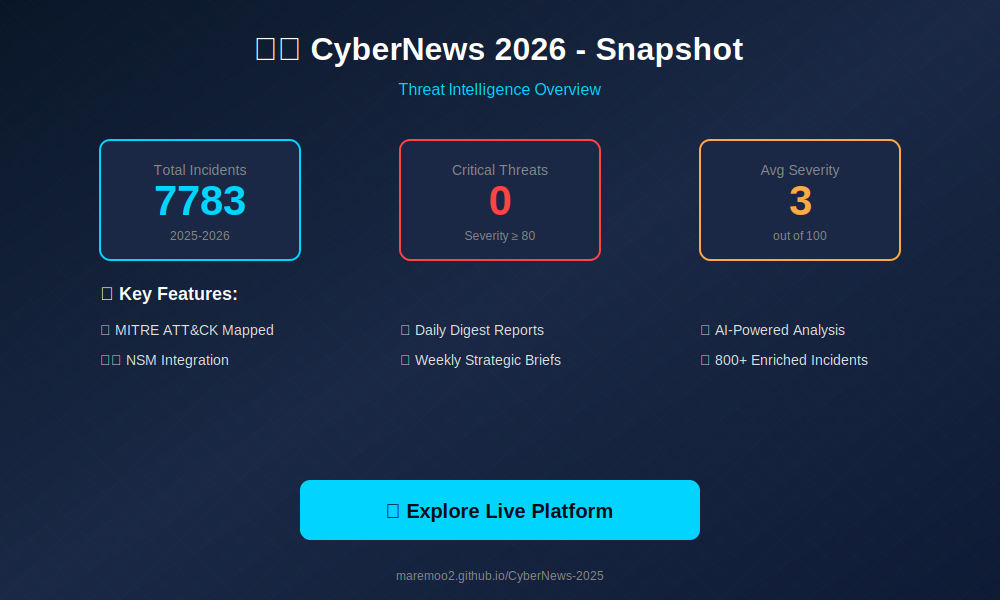
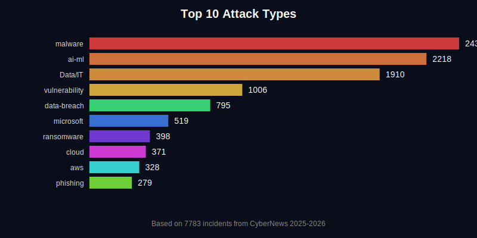
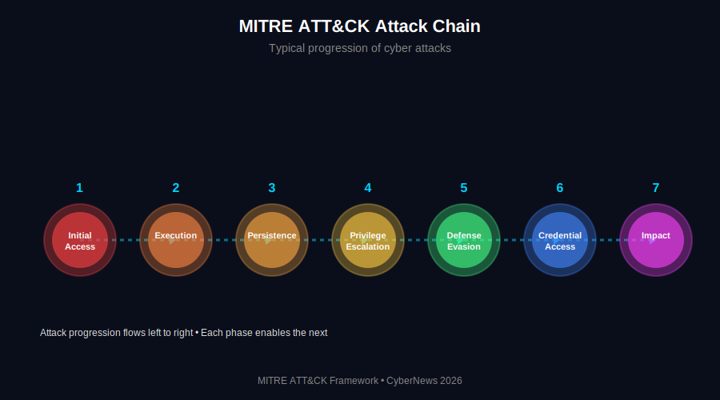

<div align="center">

# 🛡️ CyberNews 2026
### Trusseloversikt & Intelligence Portal


**[🚀 Åpne Live Platform](https://maremoo2.github.io/CyberNews-2025/)** | **[📚 Dokumentasjon](#-dokumentasjon)** | **[🤝 Bidra](#-contributing)**

---

### 📊 En datadrevet oversikt over trussellandskapet
*Strukturert, filtrerbart og visualisert for enterprise security teams*

**800+ hendelser** • **MITRE ATT&CK mapppet** • **AI-drevet analyse** • **Daglig oppdatert**

</div>

---

<div align="center">

## 📊 Visual Overview



**[🔍 Explore Full Dashboard](https://maremoo2.github.io/CyberNews-2025/)**

</div>

---

<div align="center">

## 🎯 Quick Navigation

**[📅 Daily Digest](#-daily-digest)** • **[📊 Weekly Brief](#-weekly-brief)** • **[📈 Analysis](#-analysis)** • **[📚 Incidents](#-incidents-archive)** • **[🛡️ NSM Risk](#%EF%B8%8F-nsm-risikoanalyse)** • **[🔍 Metode](#-metodikk--datagrunnlag)**

</div>

---

## 📡 Trusselbildet akkurat nå

> **Siste oppdatering:** 10. februar 2026, 09:00 CET | **Status:** 🟢 Aktiv overvåkning

### 🔥 Dagens topprisiko

<table>
<tr>
<td width="50%">

#### 🚨 KRITISK VARSEL
**Healthcare Ransomware Surge**
- 🔴 **Alvorlighetsgrad:** 92/100
- 🏥 **Sektor:** Healthcare (50+ institusjoner)
- 🌍 **Region:** EU (5 land påvirket)
- 🎭 **Aktør:** RansomHub (Cybercriminal)

**Impact:** 72 timer nedetid, 2M+ pasientdata eksfiltrert, €50M+ estimert kostnad.

**MITRE:** T1486, T1567, T1190

➡️ **[📖 Les full analyse](./daily-digests/2026-02-10.md)**

</td>
<td width="50%">

#### ⚠️ WATCH SIGNALS

| Signal | Status | Trend |
|--------|--------|-------|
| 🏥 Healthcare attacks | 🔴 ALERT | ↗️ +35% |
| �� Zero-day exploits | 🔴 ALERT | ↗️ +200% |
| 🪪 MFA-bypass | 🟡 WATCH | ↗️ +40% |
| 🌐 Nation-state | 🟡 WATCH | ↗️ +29% |
| 🔗 Supply chain | 🟢 NORMAL | ↗️ +28% |

➡️ **[📊 Se ukens brief](./weekly-briefs/week-06.md)**

</td>
</tr>
</table>

---

## 📁 Innholdsportal – Velg ditt fokusområde

<table>
<tr>
<td width="33%" align="center">

### 📅 Daily Digest
**Daglig trusseloversikt**

🔥 Top 3 hendelser  
📊 Daglige metrikker  
📈 Trendanalyse (7 dager)  
🛡️ Forsvarsanbefalinger  

**For:** Analysts, SOC Teams

➡️ **[Gå til Daily Digests](./daily-digests/README.md)**

</td>
<td width="33%" align="center">

### 📊 Weekly Brief
**Ukentlig strategisk analyse**

📈 Ukens tall i kontekst  
🔥 Top 5 hendelser  
🎯 MITRE ATT&CK mapping  
🌍 Geo & sektor-analyse  

**For:** Security Managers, CISOs

➡️ **[Gå til Weekly Briefs](./weekly-briefs/README.md)**

</td>
<td width="33%" align="center">

### 📈 Analysis
**Strategisk trendrapporter**

📊 Årlig trendanalyse  
🔍 Deep dive temaer  
🎭 Aktør-intelligence  
📅 Quarterly outlook  

**For:** CISOs, Board

➡️ **[Gå til Analysis](./analysis/README.md)**

</td>
</tr>
</table>

<table>
<tr>
<td width="50%" align="center">

### 📚 Incidents Archive
**800+ hendelser med full enrichment**

🔍 Søkbart arkiv  
🎯 MITRE-mapppet  
📊 2009-2026 data  
💾 JSON export

**For:** Threat Hunters, Researchers

➡️ **[Gå til Incidents](./incidents/README.md)**

</td>
<td width="50%" align="center">

### 🛡️ NSM Risikoanalyse
**2020-2026 rapporter**

📜 Nasjonale risikovurderinger  
📊 Historisk perspektiv  
🇳🇴 Norge-fokus  
🔍 Komparativ analyse

**For:** Policy makers, Strategy

➡️ **[Gå til NSM Risk](./context/nsm-risk/README.md)**

</td>
</tr>
</table>

> 💡 **Tips for navigasjon**  
> Bruk Quick Navigation-menyen øverst for rask tilgang til alle seksjoner. Hver seksjon har "Tilbake til toppen"-lenker for enkel navigering.

**[⬆️ Tilbake til toppen](#-quick-navigation)**

---

## 🎯 Hva gjør denne plattformen unik?

<table>
<tr>
<td width="50%">

### 🔬 Analytisk dybde

✅ **MITRE ATT&CK mapping** med confidence scoring  
✅ **Severity scoring** (0-100) med transparente kriterier  
✅ **Threat actor attribution** med kategori og confidence  
✅ **Strategic themes** – 10 predefinerte risikotemaer  
✅ **Content classification** – skiller signal fra støy  

### 📊 Enterprise features

✅ **CISO Mode** – executive dashboard  
✅ **Attack Chain Reconstruction** – multi-stage patterns  
✅ **Sector Benchmarking** – sammenlign med bransjen  
✅ **Trend Acceleration** – matematisk deteksjon  
✅ **Confidence-Weighted Analytics** – kvalitet over kvantitet  

</td>
<td width="50%">

### 🤖 AI & Automation

✅ **AI Weekly Analysis** – hypotesegenerering (OpenAI)  
✅ **Automated Enrichment** – 800+ hendelser prosessert  
✅ **RSS Feed Pipeline** – 33+ kilder, oppdateres hver 6. time  
✅ **Year Routing** – automatisk årstall-håndtering  
✅ **GitHub Actions CI/CD** – fully automated  

### 🎨 Transparens & Kvalitet

✅ **Open Methodology** – ingen hemmelige algoritmer  
✅ **Known Limitations** – ærlig om databias  
✅ **Curated Subset** – 67% high-quality incidents  
✅ **Validation Dashboard** – self-audit metrics  
✅ **Learning System** – lærer av korrigeringer  

</td>
</tr>
</table>

**[⬆️ Tilbake til toppen](#-quick-navigation)**

---

## 🚀 Quick Start

### 🌐 Bruk web-plattformen (enklest)

> ℹ️ **Anbefalte for nye brukere**  
> Web-plattformen gir deg umiddelbar tilgang til alle funksjoner uten installasjon. Perfekt for utforsking og daglig bruk.

```
👉 https://maremoo2.github.io/CyberNews-2025/
```

**Ingen installasjon nødvendig.** Fungerer i enhver moderne nettleser.

### 💻 Lokal utvikling

```bash
# Clone repository
git clone https://github.com/Maremoo2/CyberNews-2025.git
cd CyberNews-2025

# Install dependencies
npm install

# Start development server
npm run dev
# 👉 http://localhost:5173
```

### 🔧 Nyttige kommandoer

```bash
# Build for production
npm run build

# Enrich incidents (MITRE, severity, actors)
npm run enrich-enhanced

# Generate weekly aggregates
npm run aggregate-weekly

# Fetch latest news from RSS feeds
npm run fetch-rss

# Run AI weekly analysis (requires OPENAI_API_KEY)
npm run analyze-weekly

# Validate year routing
npm run validate-years
```

---

## 📊 Ukens statistikk (Uke 6, 2026)

<table>
<tr>
<td width="25%" align="center">

### 🔴 Kritiske
**21**  
↗️ +40% vs uke 5

</td>
<td width="25%" align="center">

### 📊 Total hendelser
**155**  
→ Stabilt

</td>
<td width="25%" align="center">

### 🏥 Healthcare
**27**  
↗️ +35% (top sektor)

</td>
<td width="25%" align="center">

### 💣 Zero-days
**3**  
🔴 +200% YTD

</td>
</tr>
</table>

### 🔥 Top 5 MITRE teknikker denne uken

1. **T1190** - Exploit Public-Facing Application (45 incidents, ↗️ +35%)
2. **T1486** - Data Encrypted for Impact (34 incidents, ↗️ +21%)
3. **T1566** - Phishing (31 incidents, ↗️ +16%)
4. **T1567** - Exfiltration Over Web Service (28 incidents, ↗️ +12%)
5. **T1078** - Valid Accounts (23 incidents, ↗️ +21%)

➡️ **[Se full ukesrapport](./weekly-briefs/week-06.md)**

### 📈 Visualisering: Toppangrep

<div align="center">



</div>

### 🎯 MITRE ATT&CK Attack Chain

<div align="center">



*Typisk progresjon av cyberangrep - fra initial access til impact*

</div>

**[⬆️ Tilbake til toppen](#-quick-navigation)**

---

## 🛡️ NSM Risikoanalyse 2020-2026

> 🇳🇴 **NSMs risikorapporter er nå inkludert!**  
> Se hvordan trusselbildet har utviklet seg fra 2020 til 2026, og hvordan 2026 skiller seg fra tidligere år.

**Tilgjengelige rapporter:**
- 📜 Risiko 2026 (Latest)
- 📜 Risiko 2025
- 📜 Risiko 2024
- 📜 Risiko 2023
- 📜 Risiko 2022
- 📜 Risiko 2021
- 📜 Risiko 2020

➡️ **[Les NSM-analysen](./context/nsm-risk/nsm-risk-summary.md)**

**[⬆️ Tilbake til toppen](#-quick-navigation)**

---

## 🎨 Designsystem & Visuell stil

Denne plattformen følger en **moderne, dark cybersecurity-profil** inspirert av profesjonelle threat intelligence dashboards:

### Fargekoder

- 🔴 **Kritisk (Critical):** Severity ≥80/100 - krever umiddelbar handling
- 🟠 **Høy (High):** Severity 60-79 - prioritet denne uken
- 🟡 **Moderat (Moderate):** Severity 25-59 - overvåk og planlegg
- 🟢 **Lav (Low):** Severity <25 - informasjon

### Emoji-system

| Kategori | Emoji | Bruk |
|----------|-------|------|
| **Kritisk hendelse** | 🚨🔴 | Top threats, alerts |
| **Trusler** | 🔥💣💀 | Dangerous attacks |
| **Forsvar** | 🛡️🔒🔐 | Defense, protection |
| **Analyse** | 📊📈📉 | Data, trends, stats |
| **Aktører** | 🎭👤🏴 | Threat actors |
| **Sektorer** | 🏥💰🏛️🏭 | Healthcare, Finance, Gov, Energy |
| **Geografi** | 🌍🇺🇸🇪🇺🇳🇴 | Regions, countries |
| **Taktikker** | 🎯⚔️🗡️ | Attack methods |
| **Lenker** | ➡️🔗🔍 | Navigation, search |

### UI-prinsipper (Laws of UX)

✅ **Aesthetic-Usability Effect** - Moderne, profesjonell design  
✅ **Chunking** - Innhold delt i klare seksjoner  
✅ **Cognitive Load** - Kun viktigste info først  
✅ **Jakob's Law** - Standardisert navigasjon  
✅ **Fitts's Law** - Store, lett tilgjengelige knapper  
✅ **Hick's Law** - Færre valg per skjerm  

**[⬆️ Tilbake til toppen](#-quick-navigation)**

---

## 🏗️ Teknisk arkitektur

### Tech Stack

- **Frontend:** React 19 + Vite
- **Styling:** CSS med dark cybersecurity theme
- **Data:** JSON-basert (800+ incidents)
- **Enrichment:** Node.js scripts
- **Hosting:** GitHub Pages
- **CI/CD:** GitHub Actions (automated)
- **AI:** OpenAI GPT-4 (weekly analysis)

### Data Flow

```
RSS Feeds (33+) → Inoreader API → fetch-inoreader.js
    ↓
Raw Incidents → enhanced-enrichment.js → Enriched JSON
    ↓
MITRE Mapping → Severity Scoring → Actor Attribution
    ↓
React Components → analyticsUtils.js → Dashboard
    ↓
GitHub Pages → Live Platform
```


### Enrichment Pipeline

1. **Content Extraction** - RSS feeds
2. **Severity Scoring** - 0-100 transparent system
3. **MITRE Mapping** - Two-signal rule
4. **Actor Attribution** - Name + category + confidence
5. **Theme Classification** - Top 3 per incident
6. **Quality Flagging** - Curated subset (67%)

**[⬆️ Tilbake til toppen](#-quick-navigation)**

---

## 📚 Dokumentasjon

### Core Documentation

- **[METHODOLOGY.md](./METHODOLOGY.md)** - Fullstendig metodikk og counting rules
- **[AI_ANALYSIS_GUIDE.md](./docs/AI_ANALYSIS.md)** - AI weekly analysis forklaring
- **[DEPLOYMENT_GUIDE.md](./DEPLOYMENT_GUIDE.md)** - Deployment til GitHub Pages
- **[RSS_FEEDS.md](./RSS_FEEDS.md)** - RSS feed konfiguration

### Feature Documentation

- **[ANALYTICS_PROPOSAL.md](./ANALYTICS_PROPOSAL.md)** - Original design proposal
- **[YEAR_ROUTING_VERIFIED.md](./YEAR_ROUTING_VERIFIED.md)** - Year routing verification
- **[BULK_FETCH_2025_GUIDE.md](./BULK_FETCH_2025_GUIDE.md)** - Historical data collection

---

## 💼 Use Cases

<table>
<tr>
<td width="50%">

### For Security Analysts 👨‍💻

- **Threat Hunting** - Bruk MITRE mappings
- **Trend Analysis** - Spot emerging patterns
- **Intelligence Reporting** - Export curated incidents
- **Control Validation** - Compare gaps

### For CISOs 👔

- **Board Reporting** - Executive summaries
- **Budget Justification** - Sector benchmarking
- **Strategic Planning** - Trend forecasting
- **Risk Communication** - Transparent methodology

</td>
<td width="50%">

### For SOC Teams 🛡️

- **Playbook Development** - Attack chain analysis
- **Detection Engineering** - High-confidence MITRE
- **Threat Intel Integration** - Structured JSON
- **Analyst Training** - Real-world mapped incidents

### For Researchers 📚

- **Dataset Access** - 800+ enriched incidents
- **Methodology Learning** - Practical enrichment
- **Academic Research** - Confidence-weighted data
- **Portfolio Building** - Demonstrate skills

</td>
</tr>
</table>

**[⬆️ Tilbake til toppen](#-quick-navigation)**

---

## 📊 Analytics Framework

### Severity Scoring (0-100 points)

**Impact (0-40):**
- Service disruption: +15
- Data exposure: +15
- Critical infrastructure: +20
- Large scale: +10

**Exploitability (0-30):**
- Exploited in wild: +20
- Zero-day: +15
- Internet-facing: +10

**Adversary (0-15):**
- Nation-state: +15
- Known ransomware: +10

**Severity Labels:**
- Critical: ≥80
- High: 60-79
- Moderate: 25-59
- Low: <25

### MITRE ATT&CK Mapping

**Two-Signal Rule:** Each technique requires multiple keyword matches.

Example for T1567 (Exfiltration):
- Signal 1: "exfiltrate", "upload", "leak"
- Signal 2: "OneDrive", "S3", "Drive"

**Confidence Levels:**
- HIGH: Multiple strong signals
- MEDIUM: Contextual inference
- LOW: Single keyword match

### Strategic Themes

10 predefined risk themes (max 3 per incident):

1. 🌥️ Cloud Exfiltration & SaaS Abuse
2. 💣 Exploit-Led Intrusions
3. 🪪 Identity & Token Abuse
4. 🏥 Ransomware & Extortion Economy
5. 🔗 Supply Chain & Third-Party Compromise
6. 📰 Disinformation & Deepfakes
7. 🤖 Botnets, DDoS & Commodity Malware
8. 📱 Mobile/Android & Spyware Ecosystem
9. 🏭 OT/ICS & Critical Infrastructure
10. ⚖️ Regulatory & Disclosure Pressure

**[⬆️ Tilbake til toppen](#-quick-navigation)**

---

## 🤝 Contributing

Bidrag er velkomne! For å bidra:

1. Fork repositoryet
2. Lag en feature branch (`git checkout -b feature/amazing-feature`)
3. Commit endringene (`git commit -m 'Add amazing feature'`)
4. Push til branch (`git push origin feature/amazing-feature`)
5. Åpne en Pull Request

---

## 📄 License

Dette prosjektet er open source og tilgjengelig under **MIT License**.

---

## 🙏 Acknowledgments

- **MITRE ATT&CK** - Strukturert threat taxonomy
- **Inoreader** - RSS feed aggregation
- **GitHub Pages** - Gratis hosting og CI/CD
- **Cybersecurity community** - Threat intelligence deling

---

## 📬 Kontakt

Har du spørsmål, tilbakemeldinger eller forslag?

- 🐛 [Åpne en issue](https://github.com/Maremoo2/CyberNews-2025/issues)
- 💬 GitHub Discussions
- 📧 Via GitHub profile

---

<div align="center">

**🔐 Bygget for cybersecurity community**

*Making threat intelligence accessible, explainable, and actionable.*

---

[⬆️ Tilbake til toppen](#️-cybernews-2026--trusseloversikt--intelligence-portal)

</div>
